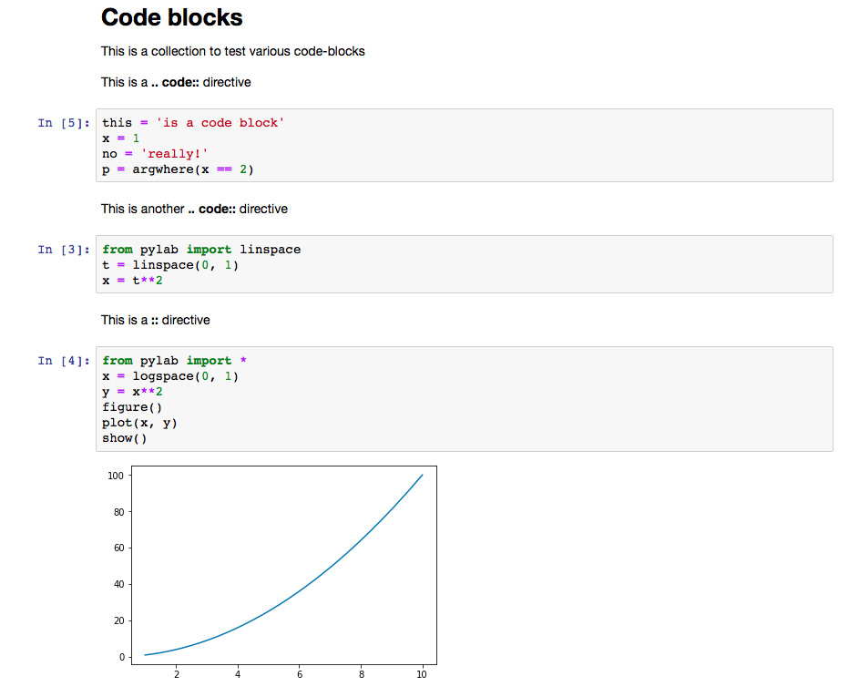
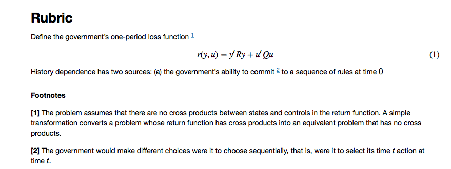
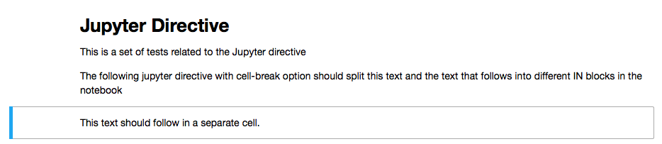
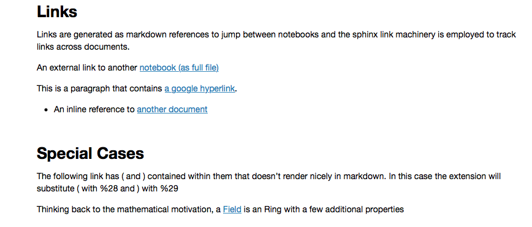
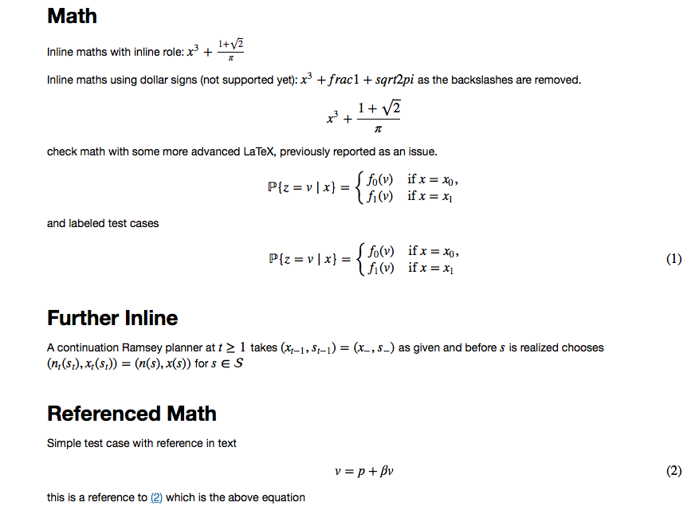
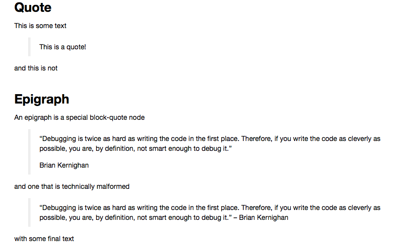
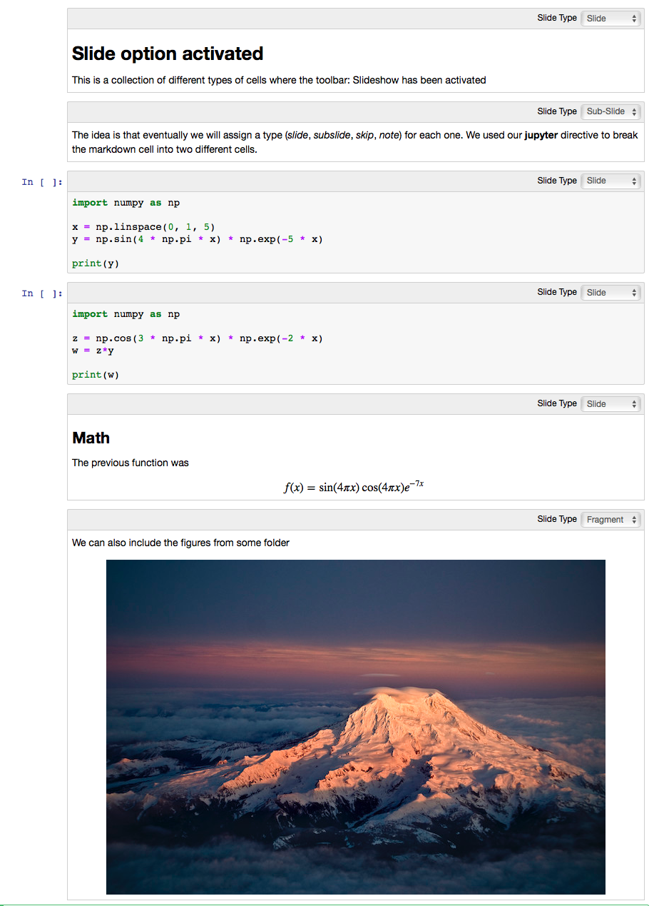
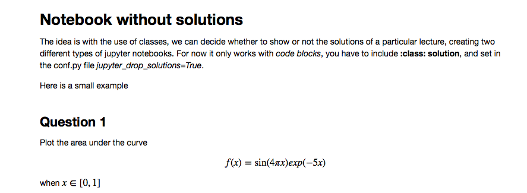
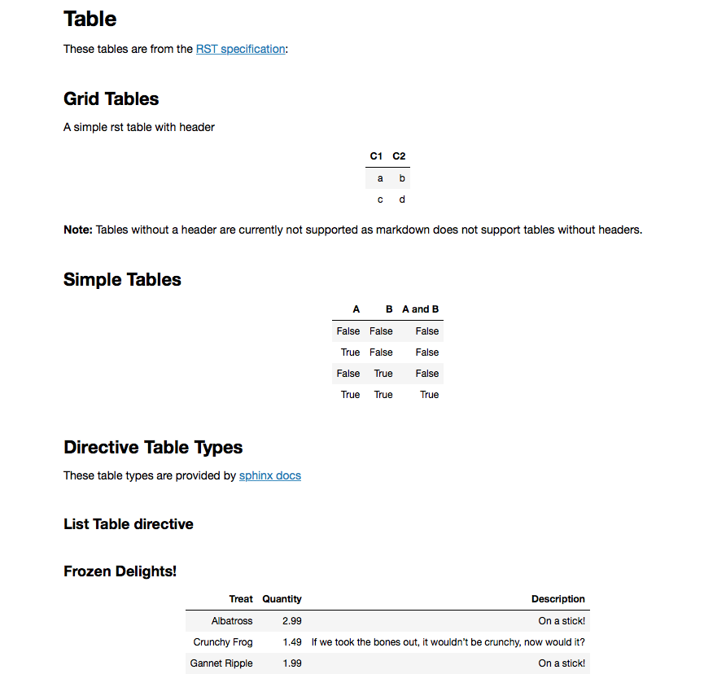
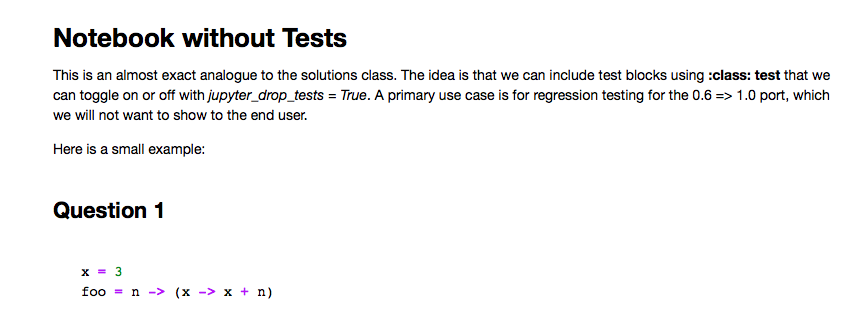

.. contents::

.. raw:: pdf

    Pagebreak oneColumn

Summary
=======

This sphinx extension can be used to build a collection of
`Jupyter <http://jupyter.org>`__ notebooks for Sphinx Projects.

**Note:** It has mainly been written to support the use case of
scientific publishing and hasn't been well tested outside of this
domain. Please provide feedback as an issue to this repository.

**Requires:** Sphinx >= 1.7.2 (for running tests). 

Installation
============

.. code:: bash

   pip install sphinxcontrib-jupyter

to get the latest version it is best to install directly by getting a copy of the repository, and

.. code:: bash

   python setup.py install

Usage
=====

Update project ``conf.py`` file to include the jupyter extension
and the desired **Configuration** settings (see configuration_ section below):

.. code:: python

    extensions = ["sphinxcontrib.jupyter"]

then run

.. code:: bash

    make jupyter

Usage in RST Files
------------------

A minimum configured sphinx repo is available `here <https://github.com/QuantEcon/sphinxcontrib-jupyter.minimal>`__
which generates a `sample notebook <https://github.com/QuantEcon/sphinxcontrib-jupyter.minimal#simple_notebookrst>`__

The following specifies the relationship between default Sphinx directives
and how they will be interpreted by this Jupyter extension.

To generate an ``In`` style executable block you can use:

.. code:: rst

    .. code-block:: {{ language }}

or,

.. code:: rst

    .. literalinclude::  {{ path_to_file }}

A ``literalinclude`` will make use of the default language in Sphinx 
to highlight the block, otherwise a language can be specified such as,

.. code:: rst

    .. literalinclude::  {{ path_to_file }}
        :language: julia

To generate a notebook that looks pre-computed you can specify output
using the ``:class: output`` option.

.. code:: rst

    .. code-block:: {{ language }}
        :class: output

To include code in the notebook that is not meant for execution you can use
the ``:class: no-execute``. This is useful when writing code
that is meant to throw errors, for example.

.. code:: rst

    .. code-block:: {{ language }}
        :class: no-execute

this will generate a highlighted markdown cell of the contents of the
code-block. An alias for this is ``:class: skip-test``. This is used
in the context of a test environment that is using the collection of 
notebooks to test a collection of code snippets.

.. todo:: 

    It might be nice to add screenshots to demonstrate the correlation between 
    the blocks above and the representation in the notebook.

Output blocks may be constructed and it will be paired directly with the 
previous ``In`` type code block. This can be used to construct notebooks that
look like they have already been pre-executed.

.. code:: rst

    .. code-block:: {{ language }}
        :class: output

.. todo::

    Discuss this feature. It may be better to generate and then execute the
    notebook to get notebooks that are pre-formatted with output figures etc.
    This would ensure output stays consistent with the code that generates it.

Math
~~~~

Equations are transferred into the notebook environment and wrapped in 
``$`` for inline or ``$$`` for display formulae. 

Equation numbering is respected on the individual notebook level and is 
implemented using html links in each notebook.

Exercise Solutions
~~~~~~~~~~~~~~~~~~

The extension has support for ``:class: solution`` on code-blocks. This
allows for the compilation of two sets of notebooks, one containing solutions
and one without.

Test Blocks
~~~~~~~~~~~

Other class options for code-blocks include `test` to indicate the 
code block contains a test which can be used for adding test logic
for automatic testing of notebooks. This is by default set to `False`
in the configuration and all test blocks are dropped.

Jupyter Directive and Slides
~~~~~~~~~~~~~~~~~~~~~~~~~~~~

The ``jupyter`` directive accepts three different arguments ``cell-break``, ``slide`` and ``slide-type``
How to use them is explained bellow

cell-break
++++++++++

.. code:: rst
    
    .. jupyter::
        :cell-break:

it is used to break a `markdown_cell` in two, this is done for example, when a paragraph 
is too large to fit in one slide.

slide
+++++

If the user wants to create a notebook where the cells are converted into
slides the folowing code needs to be included at the top of the .rst file.

.. code:: rst

    .. jupyter::
        :slide: {{enable/disable}}

``:slide: enable`` activates the slideshow metadata into the jupyter notebook, 
setting as a default value that each **cell** is a **slide**. 
The directive detects automatically the different cells 
(going from a ``markdown_cell`` to a ``code_cell`` for example), 
but also new cells are created when a subtitle is detected. If the user wants to force
a new cell, the option ``cell-break`` can be added.

slide-type
++++++++++

The default value for each cell would be ``slide``. If the user wants
to change the upcoming cell to something different (``subslide``, ``fragment``, ``notes``, ``skip``)
the following code must be included

.. code:: rst

    .. jupyter::
        :slide-type: subslide

Other Supported Directives
~~~~~~~~~~~~~~~~~~~~~~~~~~

1. ``.. note::`` - the raw contents of this directive is included 
into the notebook as a block quote with a **Note** title.

2. ``.. only::`` - this will skip any only content that is not jupyter 

.. _configuration:

Configuration
=============

The following additions must be made to ``conf.py`` file.

.. code:: python

    # --------------------------------------------
    # sphinxcontrib-jupyter Configuration Settings
    # --------------------------------------------

    # Conversion Mode Settings
    # If "all", convert codes and texts into jupyter notebook
    # If "code", convert code-blocks only
    jupyter_conversion_mode = "all"

    jupyter_write_metadata = True

    # Location for _static folder
    jupyter_static_file_path = ["_static"]

    # Configure Jupyter Kernels
    jupyter_kernels = {
        "python3": {
            "kernelspec": {
                "display_name": "Python",
                "language": "python3",
                "name": "python3"
                },
            "file_extension": ".py",
        },
        "julia": {
            "kernelspec": {
                "display_name": "Julia 0.6.0",
                "language": "julia",
                "name": "julia-0.6"
                },
            "file_extension": ".jl"
        }
    }

    # Configure default language for Jupyter notebooks
    # Can be changed in each notebook thanks to the ..highlight:: directive
    jupyter_default_lang = "python3"
 
    # Configure Jupyter headers
    jupyter_headers = {
        "python3": [
        ],
        "julia": [
        ],
    }

    # Prepend a Welcome Message to Each Notebook
    jupyter_welcome_block = "welcome.rst"

    # Solutions Configuration
    jupyter_drop_solutions = True

    # Tests configurations 
    jupyter_drop_tests = True

    # Add Ipython as Synonym for tests
    jupyter_lang_synonyms = ["ipython"]

    

Examples
========

Most of the functionalities have been tested `here <https://github.com/QuantEcon/sphinxcontrib-jupyter/tree/master/tests>`__
but we include in this section some of the main examples.

code-blocks
-----------
The following code in the .rst file 

.. code:: rst
    
    Code blocks
    -----------

    This is a collection to test various code-blocks

    This is a **.. code::** directive

    .. code:: python

        this = 'is a code block'
        x = 1
        no = 'really!'
        p = argwhere(x == 2)

    This is another **.. code::** directive

    .. code:: python

        from pylab import linspace
        t = linspace(0, 1)
        x = t**2

    This is a **::** directive

    ::

        from pylab import *
        x = logspace(0, 1)
        y = x**2
        figure()
        plot(x, y)
        show()

will look as follows in the jupyter notebook

footnotes
---------

The following code in the .rst file 

.. code:: rst

    Rubric
    ======

    Define the government's one-period loss function [#f1]_

    .. math::
        :label: target

        r(y, u)  =  y' R y  + u' Q u

    History dependence has two sources: (a) the government's ability to commit [#f2]_ to a sequence of rules at time :math:`0`

    .. rubric:: Footnotes

    .. [#f1] The problem assumes that there are no cross products between states and controls in the return function.  A simple transformation  converts a problem whose return function has cross products into an equivalent problem that has no cross products.

    .. [#f2] The government would make different choices were it to choose sequentially, that is,  were it to select its time :math:`t` action at time :math:`t`.

will look as follows in the jupyter notebook

images and figures
------------------

The following code in the .rst file 

.. code:: rst 

    Images
    ======

    Collection of tests for **.. image::** and **.. figure::** directives

    Image
    -----

    `Docutils Reference <http://docutils.sourceforge.net/docs/ref/rst/directives.html#images>`__

    Most basic image directive

    .. image:: _static/hood.jpg

    A scaled down version with 25 % width

    .. image:: _static/hood.jpg
    :width: 25 %

    A height of 50px

    .. image:: _static/hood.jpg
    :height: 50px

    Figure
    ------

    `Docutils Reference <http://docutils.sourceforge.net/docs/ref/rst/directives.html#figure>`__

    Testing the **.. figure::** directive

    .. figure:: _static/hood.jpg
    :scale: 50 %

will look as follows in the jupyter notebook

jupyter-directive
-----------------

The following code in the .rst file 

.. code:: rst 

    Jupyter Directive
    =================

    This is a set of tests related to the Jupyter directive

    The following jupyter directive with cell-break option should
    split this text and the text that follows into different IN
    blocks in the notebook

    .. jupyter::
        :cell-break:

    This text should follow in a separate cell.

will look as follows in the jupyter notebook

links
-----

The following code in the .rst file 

.. code:: rst 

    .. _links:

    Links
    -----

    Links are generated as markdown references to jump between notebooks and
    the sphinx link machinery is employed to track links across documents.

    An external link to another `notebook (as full file) <links_target.ipynb>`_

    This is a paragraph that contains `a google hyperlink`_.

    .. _a google hyperlink: https://google.com.au

    - An inline reference to :ref:`another document <links_target>`

    Special Cases
    -------------

    The following link has ( and ) contained within them that doesn't render nicely in markdown. In this case the extension will substitute ( with `%28` and ) with `%29`

    Thinking back to the mathematical motivation, a `Field <https://en.wikipedia.org/wiki/Field_\(mathematics\)>`_ is an `Ring` with a few additional properties

will look as follows in the jupyter notebook

math
----

The following code in the .rst file 

.. code:: rst 

    Math
    ----

    Inline maths with inline role: :math:`x^3+\frac{1+\sqrt{2}}{\pi}`

    Inline maths using dollar signs (not supported yet): $x^3+\frac{1+\sqrt{2}}{\pi}$ as the 
    backslashes are removed.

    .. math::

    x^3+\frac{1+\sqrt{2}}{\pi}

    check math with some more advanced LaTeX, previously reported as an issue.

    .. math::

        \mathbb P\{z = v \mid x \}
        = \begin{cases} 
            f_0(v) & \mbox{if } x = x_0, \\
            f_1(v) & \mbox{if } x = x_1
        \end{cases} 

    and labeled test cases

    .. math::
    :label: firsteq

        \mathbb P\{z = v \mid x \}
        = \begin{cases} 
            f_0(v) & \mbox{if } x = x_0, \\
            f_1(v) & \mbox{if } x = x_1
        \end{cases} 

    Further Inline
    --------------

    A continuation Ramsey planner at :math:`t \geq 1` takes 
    :math:`(x_{t-1}, s_{t-1}) = (x_-, s_-)` as given and before 
    :math:`s` is realized chooses 
    :math:`(n_t(s_t), x_t(s_t)) = (n(s), x(s))` for :math:`s \in  {\cal S}`

    Referenced Math
    ---------------

    Simple test case with reference in text

    .. math::
    :label: test

        v = p + \beta v

    this is a reference to :eq:`test` which is the above equation

will look as follows in the jupyter notebook

quote
-----

The following code in the .rst file 

.. code:: rst 

    Quote
    -----

    This is some text

        This is a quote!

    and this is not

    Epigraph
    --------

    An epigraph is a special block-quote node

    .. epigraph::

    "Debugging is twice as hard as writing the code in the first place.
    Therefore, if you write the code as cleverly as possible, you are, by definition,
    not smart enough to debug it."
    
    -- Brian Kernighan

    and one that is technically malformed

    .. epigraph::

    "Debugging is twice as hard as writing the code in the first place.
    Therefore, if you write the code as cleverly as possible, you are, by definition,
    not smart enough to debug it." -- Brian Kernighan

    with some final text

will look as follows in the jupyter notebook

slides
------

The following code in the .rst file 

.. code:: rst 

    Slide option activated
    ----------------------

    .. jupyter::
        :slide: enable

    This is a collection of different types of cells where the toolbar: Slideshow has been activated

    .. jupyter::
        :cell-break:
        :slide-type: subslide

    The idea is that eventually we will assign a type (*slide*, *subslide*, *skip*, *note*) for each one. We used our **jupyter** directive  to break the markdown cell into two different cells.

    .. code:: python3

        import numpy as np

        x = np.linspace(0, 1, 5)
        y = np.sin(4 * np.pi * x) * np.exp(-5 * x)

        print(y)

    .. code:: python3

        import numpy as np

        z = np.cos(3 * np.pi * x) * np.exp(-2 * x)
        w = z*y

        print(w)

    Math 
    ++++

        
    The previous function was 

    .. math:: f(x)=\sin(4\pi x)\cos(4\pi x)e^{-7x}

    .. jupyter::
        :cell-break:
        :slide-type: fragment

    We can also include the figures from some folder

    .. figure:: _static/hood.jpg

will look as follows in the jupyter notebook

solutions
---------

The following code in the .rst file 

.. code:: rst 

    Notebook without solutions
    ==========================

    The idea is with the use of classes, we can  decide whether to show or not the solutions
    of a particular lecture, creating two different types of jupyter notebooks. For now it only 
    works with *code blocks*, you have to include **:class: solution**, and set in  the conf.py file
    *jupyter_drop_solutions=True*.

    Here is a small example

    Question 1
    ----------

    Plot the area under the curve 

    .. math::

        f(x)=\sin(4\pi x) exp(-5x)

    when :math:`x \in [0,1]`

    .. code-block:: python3
        :class: solution

        import numpy as np
        import matplotlib.pyplot as plt

        x = np.linspace(0, 1, 500)
        y = np.sin(4 * np.pi * x) * np.exp(-5 * x)

        fig, ax = plt.subplots()

        ax.fill(x, y, zorder=10)
        ax.grid(True, zorder=5)
        plt.show()

will look as follows in the jupyter notebook

tables
------

The following code in the .rst file 

.. code:: rst 

    Table
    =====

    These tables are from the `RST specification <http://docutils.sourceforge.net/docs/ref/rst/restructuredtext.html#grid-tables>`__: 

    Grid Tables
    -----------

    A simple rst table with header

    +------+------+
    | C1   | C2   |
    +======+======+
    | a    | b    |
    +------+------+
    | c    | d    |
    +------+------+

    **Note:** Tables without a header are currently not supported as markdown does
    not support tables without headers.

    Simple Tables
    -------------

    =====  =====  =======
    A      B    A and B
    =====  =====  =======
    False  False  False
    True   False  False
    False  True   False
    True   True   True
    =====  =====  =======

    Directive Table Types
    ---------------------

    These table types are provided by `sphinx docs <http://www.sphinx-doc.org/en/master/rest.html#directives>`__

    List Table directive
    ~~~~~~~~~~~~~~~~~~~~

    .. list-table:: Frozen Delights!
    :widths: 15 10 30
    :header-rows: 1

    * - Treat
        - Quantity
        - Description
    * - Albatross
        - 2.99
        - On a stick!
    * - Crunchy Frog
        - 1.49
        - If we took the bones out, it wouldn't be crunchy, now would it?
    * - Gannet Ripple
        - 1.99
        - On a stick!

will look as follows in the jupyter notebook

tests
-----

The following code in the .rst file 

.. code:: rst 

    Notebook without Tests 
    ======================

    This is an almost exact analogue to the solutions class. The idea is that we can include test blocks using **:class: test** that we can toggle on or off with *jupyter_drop_tests = True*. A primary use case is for regression testing for the 0.6 => 1.0 port, which we will not want to show to the end user. 

    Here is a small example: 

    Question 1
    ------------

    .. code-block:: julia 

        x = 3 
        foo = n -> (x -> x + n)

    .. code-block:: julia 
        :class: test 

        import Test 
        @test x == 3
        @test foo(3) isa Function 
        @test foo(3)(4) == 7 

will look as follows in the jupyter notebook

Credits
=======

This project is supported by `QuantEcon <https://www.quantecon.org>`__

Many thanks to the contributors of this project.

* `@mmcky <https://github.com/mmcky>`__
* `@myuuuuun <https://github.com/myuuuuun>`__ 
* `@NickSifniotis <https://github.com/NickSifniotis>`__
* `@FelipeMaldonado <https://github.com/FelipeMaldonado>`__

Projects using Extension
------------------------

1. `QuantEcon Lectures <https://lectures.quantecon.org>`__

If you find this extension useful please let us know at
contact@quantecon.org

LICENSE
=======

Copyright © 2018 QuantEcon Development Team: BSD-3 All rights reserved.

Redistribution and use in source and binary forms, with or without
modification, are permitted provided that the following conditions are
met:

1. Redistributions of source code must retain the above copyright
   notice, this list of conditions and the following disclaimer.

2. Redistributions in binary form must reproduce the above copyright
   notice, this list of conditions and the following disclaimer in the
   documentation and/or other materials provided with the distribution.

3. Neither the name of the copyright holder nor the names of its
   contributors may be used to endorse or promote products derived from
   this software without specific prior written permission.

THIS SOFTWARE IS PROVIDED BY THE COPYRIGHT HOLDERS AND CONTRIBUTORS "AS
IS" AND ANY EXPRESS OR IMPLIED WARRANTIES, INCLUDING, BUT NOT LIMITED
TO, THE IMPLIED WARRANTIES OF MERCHANTABILITY AND FITNESS FOR A
PARTICULAR PURPOSE ARE DISCLAIMED. IN NO EVENT SHALL THE COPYRIGHT
HOLDER OR CONTRIBUTORS BE LIABLE FOR ANY DIRECT, INDIRECT, INCIDENTAL,
SPECIAL, EXEMPLARY, OR CONSEQUENTIAL DAMAGES (INCLUDING, BUT NOT LIMITED
TO, PROCUREMENT OF SUBSTITUTE GOODS OR SERVICES; LOSS OF USE, DATA, OR
PROFITS; OR BUSINESS INTERRUPTION) HOWEVER CAUSED AND ON ANY THEORY OF
LIABILITY, WHETHER IN CONTRACT, STRICT LIABILITY, OR TORT (INCLUDING
NEGLIGENCE OR OTHERWISE) ARISING IN ANY WAY OUT OF THE USE OF THIS
SOFTWARE, EVEN IF ADVISED OF THE POSSIBILITY OF SUCH DAMAGE.
