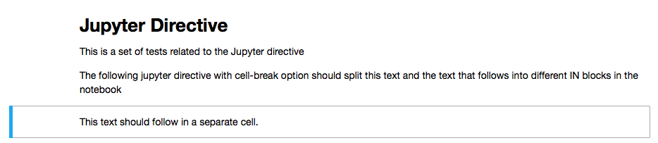
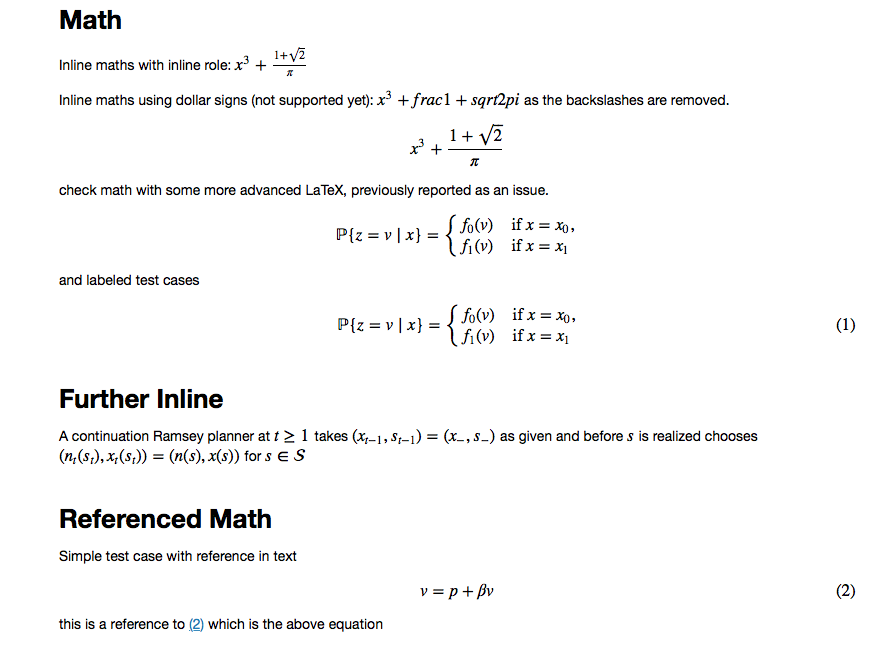
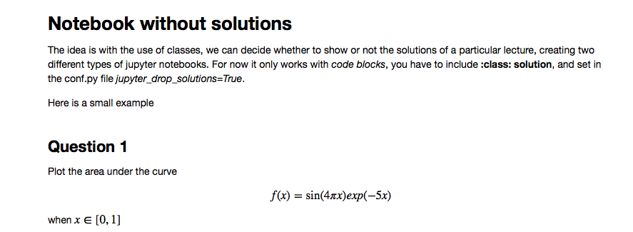
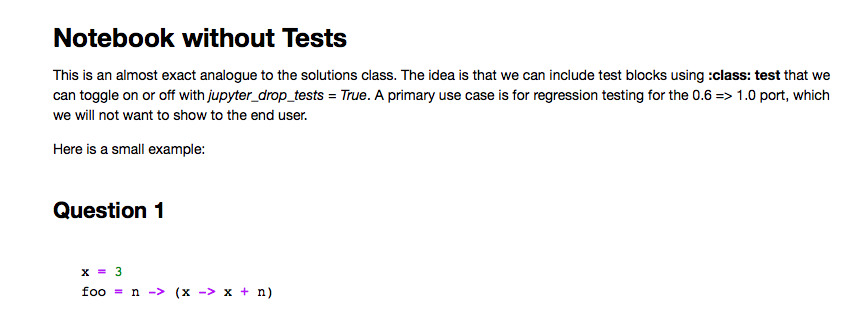

.. _examples:

RST Conversion Gallery
======================

.. note::

    A minimum configured sphinx repo is available `here <https://github.com/QuantEcon/sphinxcontrib-jupyter.minimal>`__
    which generates a `sample notebook <https://github.com/QuantEcon/sphinxcontrib-jupyter.minimal#simple_notebookrst>`__

.. contents:: Examples

The test suite, located `here <https://github.com/QuantEcon/sphinxcontrib-jupyter/tree/master/tests>`__
provides examples of conversions between RST and the Jupyter notebook which form the test cases 
for this extension. It can be a useful resource to check how elements are converted if they are not 
contained in this gallery.

code-blocks
-----------

The following code in the **.rst** file 

.. code:: rst
    
    Code blocks
    -----------

    This is a collection to test various code-blocks

    This is a **.. code::** directive

    .. code:: python

        this = 'is a code block'
        x = 1
        no = 'really!'
        p = argwhere(x == 2)

    This is another **.. code::** directive

    .. code:: python

        from pylab import linspace
        t = linspace(0, 1)
        x = t**2

    This is a **::** directive

    ::

        from pylab import *
        x = logspace(0, 1)
        y = x**2
        figure()
        plot(x, y)
        show()

will look as follows in the jupyter notebook

.. image:: img/code-block.png

images and figures
------------------

The following code in the .rst file 

.. code:: rst 

    Images
    ======

    Collection of tests for **.. image::** and **.. figure::** directives

    Image
    -----

    `Docutils Reference <http://docutils.sourceforge.net/docs/ref/rst/directives.html#images>`__

    Most basic image directive

    .. image:: _static/hood.jpg

    A scaled down version with 25 % width

    .. image:: _static/hood.jpg
    :width: 25 %

    A height of 50px

    .. image:: _static/hood.jpg
    :height: 50px

    Figure
    ------

    `Docutils Reference <http://docutils.sourceforge.net/docs/ref/rst/directives.html#figure>`__

    Testing the **.. figure::** directive

    .. figure:: _static/hood.jpg
    :scale: 50 %

will look as follows in the jupyter notebook

.. image:: img/figure.png

.. warning::

    if :code:`jupyter_images_markdown = True` then the ``:scale:``, ``:height:`` 
    and ``:width:`` attributes will be ignored.

jupyter-directive
-----------------

The following code in the .rst file 

.. code:: rst 

    Jupyter Directive
    =================

    This is a set of tests related to the Jupyter directive

    The following jupyter directive with cell-break option should
    split this text and the text that follows into different IN
    blocks in the notebook

    .. jupyter::
        :cell-break:

    This text should follow in a separate cell.

will look as follows in the jupyter notebook

links
-----

The following code in the .rst file 

.. code:: rst 

    .. _links:

    Links
    -----

    Links are generated as markdown references to jump between notebooks and
    the sphinx link machinery is employed to track links across documents.

    An external link to another `notebook (as full file) <links_target.ipynb>`_

    This is a paragraph that contains `a google hyperlink`_.

    .. _a google hyperlink: https://google.com.au

    - An inline reference to :ref:`another document <links_target>`

    Special Cases
    -------------

    The following link has ( and ) contained within them that doesn't render nicely in markdown. In this case the extension will substitute ( with `%28` and ) with `%29`

    Thinking back to the mathematical motivation, a `Field <https://en.wikipedia.org/wiki/Field_\(mathematics\)>`_ is an `Ring` with a few additional properties

will look as follows in the jupyter notebook

.. image:: img/links.png

math
----

The following code in the .rst file 

.. code:: rst 

    Math
    ----

    Inline maths with inline role: :math:`x^3+\frac{1+\sqrt{2}}{\pi}`

    Inline maths using dollar signs (not supported yet): $x^3+\frac{1+\sqrt{2}}{\pi}$ as the 
    backslashes are removed.

    .. math::

    x^3+\frac{1+\sqrt{2}}{\pi}

    check math with some more advanced LaTeX, previously reported as an issue.

    .. math::

        \mathbb P\{z = v \mid x \}
        = \begin{cases} 
            f_0(v) & \mbox{if } x = x_0, \\
            f_1(v) & \mbox{if } x = x_1
        \end{cases} 

    and labeled test cases

    .. math::
       :label: firsteq

        \mathbb P\{z = v \mid x \}
        = \begin{cases} 
            f_0(v) & \mbox{if } x = x_0, \\
            f_1(v) & \mbox{if } x = x_1
        \end{cases} 

    Further Inline
    --------------

    A continuation Ramsey planner at :math:`t \geq 1` takes 
    :math:`(x_{t-1}, s_{t-1}) = (x_-, s_-)` as given and before 
    :math:`s` is realized chooses 
    :math:`(n_t(s_t), x_t(s_t)) = (n(s), x(s))` for :math:`s \in  {\cal S}`

    Referenced Math
    ---------------

    Simple test case with reference in text

    .. math::
       :label: test

        v = p + \beta v

    this is a reference to :eq:`test` which is the above equation

will look as follows in the jupyter notebook

block-quote
-----------

The following code in the .rst file 

.. code:: rst 

    Quote
    -----

    This is some text

        This is a quote!

    and this is not

    Epigraph
    --------

    An epigraph is a special block-quote node

    .. epigraph::

        "Debugging is twice as hard as writing the code in the first place.
        Therefore, if you write the code as cleverly as possible, you are, by definition,
        not smart enough to debug it."
    
    -- Brian Kernighan

    and one that is technically malformed

    .. epigraph::

        "Debugging is twice as hard as writing the code in the first place.
        Therefore, if you write the code as cleverly as possible, you are, by definition,
        not smart enough to debug it." -- Brian Kernighan

    with some final text

will look as follows in the jupyter notebook

.. image:: img/quote.png

slides
------

The following code in the .rst file 

.. code:: rst 

    Slide option activated
    ----------------------

    .. jupyter::
        :slide: enable

    This is a collection of different types of cells where the toolbar: Slideshow has been activated

    .. jupyter::
        :cell-break:
        :slide-type: subslide

    The idea is that eventually we will assign a type (*slide*, *subslide*, *skip*, *note*) for each one. We used our **jupyter** directive  to break the markdown cell into two different cells.

    .. code:: python3

        import numpy as np

        x = np.linspace(0, 1, 5)
        y = np.sin(4 * np.pi * x) * np.exp(-5 * x)

        print(y)

    .. code:: python3

        import numpy as np

        z = np.cos(3 * np.pi * x) * np.exp(-2 * x)
        w = z*y

        print(w)

    Math 
    ++++

    The previous function was 

    .. math:: f(x)=\sin(4\pi x)\cos(4\pi x)e^{-7x}

    .. jupyter::
        :cell-break:
        :slide-type: fragment

    We can also include the figures from some folder

    .. figure:: _static/hood.jpg

will look as follows in the jupyter notebook

.. image:: img/slides.png

footnotes
---------

The following code in the .rst file 

.. code:: rst

    Rubric
    ======

    Define the government's one-period loss function [#f1]_

    .. math::
        :label: target

        r(y, u)  =  y' R y  + u' Q u

    History dependence has two sources: (a) the government's ability to commit [#f2]_ to a sequence of rules at time :math:`0`

    .. rubric:: Footnotes

    .. [#f1] The problem assumes that there are no cross products between states and controls in the return function.  A simple transformation  converts a problem whose return function has cross products into an equivalent problem that has no cross products.

    .. [#f2] The government would make different choices were it to choose sequentially, that is,  were it to select its time :math:`t` action at time :math:`t`.

will look as follows in the jupyter notebook

.. image:: img/footnotes.png

solutions
---------

The following code in the .rst file 

.. code:: rst 

    Notebook without solutions
    ==========================

    The idea is with the use of classes, we can  decide whether to show or not the solutions
    of a particular lecture, creating two different types of jupyter notebooks. For now it only 
    works with *code blocks*, you have to include **:class: solution**, and set in  the conf.py file
    *jupyter_drop_solutions=True*.

    Here is a small example

    Question 1
    ----------

    Plot the area under the curve 

    .. math::

        f(x)=\sin(4\pi x) exp(-5x)

    when :math:`x \in [0,1]`

    .. code-block:: python3
        :class: solution

        import numpy as np
        import matplotlib.pyplot as plt

        x = np.linspace(0, 1, 500)
        y = np.sin(4 * np.pi * x) * np.exp(-5 * x)

        fig, ax = plt.subplots()

        ax.fill(x, y, zorder=10)
        ax.grid(True, zorder=5)
        plt.show()

will look as follows in the jupyter notebook

.. todo::

    Currently generating the two sets of notebooks requires two separate
    runs of sphinx which is incovenient. It would be better to develop a set 
    of notebooks without solutions (as Default) and a set of notebooks with
    solutions in a subdir.

tables
------

Basic table support is provided by this extension. 

.. note::

    Complex tables are **not** currently supported. 
    See Issue [#54](https://github.com/QuantEcon/sphinxcontrib-jupyter/issues/54)

The following code in the .rst file 

.. code:: rst 

    Table
    =====

    These tables are from the `RST specification <http://docutils.sourceforge.net/docs/ref/rst/restructuredtext.html#grid-tables>`__: 

    Grid Tables
    -----------

    A simple rst table with header

    +------+------+
    | C1   | C2   |
    +======+======+
    | a    | b    |
    +------+------+
    | c    | d    |
    +------+------+

    **Note:** Tables without a header are currently not supported as markdown does
    not support tables without headers.

    Simple Tables
    -------------

    =====  =====  =======
    A      B    A and B
    =====  =====  =======
    False  False  False
    True   False  False
    False  True   False
    True   True   True
    =====  =====  =======

    Directive Table Types
    ---------------------

    These table types are provided by `sphinx docs <http://www.sphinx-doc.org/en/master/rest.html#directives>`__

    List Table directive
    ~~~~~~~~~~~~~~~~~~~~

    .. list-table:: Frozen Delights!
    :widths: 15 10 30
    :header-rows: 1

    * - Treat
        - Quantity
        - Description
    * - Albatross
        - 2.99
        - On a stick!
    * - Crunchy Frog
        - 1.49
        - If we took the bones out, it wouldn't be crunchy, now would it?
    * - Gannet Ripple
        - 1.99
        - On a stick!

will look as follows in the jupyter notebook

.. image:: img/tables.png

tests
-----

The following code in the .rst file 

.. code:: rst 

    Notebook without Tests 
    ======================

    This is an almost exact analogue to the solutions class. The idea is that we can include test blocks using **:class: test** that we can toggle on or off with *jupyter_drop_tests = True*. A primary use case is for regression testing for the 0.6 => 1.0 port, which we will not want to show to the end user. 

    Here is a small example: 

    Question 1
    ------------

    .. code-block:: julia 

        x = 3 
        foo = n -> (x -> x + n)

    .. code-block:: julia 
        :class: test 

        import Test 
        @test x == 3
        @test foo(3) isa Function 
        @test foo(3)(4) == 7 

will look as follows in the jupyter notebook

.. note::

    inclusion of tests in the generated notebook can be controlled in the ``conf.py``
    file using :code:`jupyter_drop_tests = False`. This is useful when using the 
    ``coverage`` build pathway. 