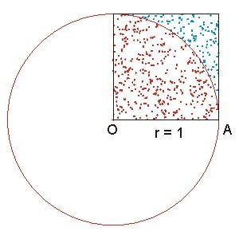

Probability, Statistics and Simulation in Python
================================================

| ECON 3127/4414/8014 Computational methods in economics
| Week 6 Fedor Iskhakov
| 

📖 Kevin Sheppard "Introduction to Python for Econometrics, Statistics
and Data Analysis." *Chapter: 19*

Plan for the lecture
--------------------

1. Random variables and samples
2. Random number generators
3. Monte Carlo experiments
4. Application

Theory of probabilities - Statistics - Econometrics
~~~~~~~~~~~~~~~~~~~~~~~~~~~~~~~~~~~~~~~~~~~~~~~~~~~

-  Theory of probabilities - Analysis with known distribution laws
-  Mathematical statistics - Analysis of data from unknown distributions
-  Econometrics - Application of statistics to economics

Random variables
~~~~~~~~~~~~~~~~

.. math::

   \tilde{X} = \big( \Omega, \mathfrak{A}, P \big)

-  :math:`\Omega` set of all outcomes
-  :math:`\mathfrak{A}` sigma-algebra of events (subsets of
   :math:`\Omega`)
-  :math:`P` probability measure over :math:`\mathfrak{A}`

Discrete random variables
~~~~~~~~~~~~~~~~~~~~~~~~~

-  :math:`\Omega` is finite with :math:`n` elements
-  :math:`\mathfrak{A}` is set of all subsets of :math:`\Omega`
-  :math:`P` is constructed from :math:`(p_1,p_2,\dots,p_n)` 
-  :math:`F(x) = P({\tilde{X}<x})` cumulative distribution function, stepwise discontinuous

Continuous random variables
~~~~~~~~~~~~~~~~~~~~~~~~~~~

-  :math:`\Omega` is subset of :math:`\mathbb{R}`
-  :math:`\mathfrak{A}` is Borel set on :math:`\Omega`
-  :math:`P([a,b]) = F(b) - F(a)`

.. math:: F(x) = \int_{-\infty}^x f(t) dt

-  :math:`F(x)` cumulative distribution function, continuous
-  :math:`f(x)` probability density function

Moments of random variables
~~~~~~~~~~~~~~~~~~~~~~~~~~~

-  First, mean, measure of *central tendency*

.. math::

   E(\tilde{X}) = \int_{\Omega} x \,dF(x) = \int_{\Omega} x f(x) \,dx \quad\text{or}\quad =\sum_{i=1}^{n} x_i p_i

-  Second central, variance, measure of *variability*

.. math::

   D(\tilde{X}) = V(\tilde{X}) = Var (\tilde{X}) = E\big(\tilde{X}- E(\tilde{X})\big)^2

-  Standard deviation = square root of variance (same units as mean)

Random sample
~~~~~~~~~~~~~

Realizations of a random variable :math:`\tilde{X}` are
:math:`\{x_1,x_2,\dots,x_n\} \sim F_{\tilde{X}}(x)` drawn independently
one by one

.. math::

   \tilde{E} = \big( \Omega, \mathfrak{A}, \mathfrak{P} \big), \; \mathfrak{P}=\{P_\theta, \theta \in \Theta\}

Random sample generated by distribution with *true parameter*
:math:`\theta_0` (data generating process)

Statistics
~~~~~~~~~~

*Statistic* - any function of the data *or* statistical experiments
:math:`\tilde{E}`

*Estimator* - statistic of experiments, theoretical properties

*Estimate* - computed using the data value of the estimator

.. math::

   \bar{x} = \frac{1}{n} \sum_{i=1}^{n} x_i  \quad s = \frac{1}{n-1} \sum_{i=1}^{n} (x_i-\bar{x})^2

Simulation :math:`\sim` Random sample
~~~~~~~~~~~~~~~~~~~~~~~~~~~~~~~~~~~~~

Simulation of the random variable is the same as random sampling (except
the data in the latter is *given*)

Economic model (with shocks), as a function of the random variable, is a
random variable itself.

The complex underlying distribution cab be studied by simulation *of the
model*

Fair coin?
~~~~~~~~~~

Imagine a coin of some sort, we don't know if it is fair (has equal
probabilities of heads and tails) or not.

Keep tossing the coin and count the number of outcomes (simulate the
outcomes), plot the share

.. code:: ipython3

    import numpy as np
    import random
    import matplotlib.pyplot as plt
    import matplotlib.animation as anim
    import time
    
    # nice interactive plot panels in the notebook
    %matplotlib notebook
    
    xdata, ydata = [], []
    N=100
    
    def init():
        ax.set_xlim(0,N)
        ax.set_ylim(0, 1)
        plt.plot([0,N], [0.5,0.5],':',c='grey')
        return ln,
    
    def update(k):
        coin = toss_coin()
        xdata.append(k)
        if len(ydata)==0:
            ydata.append(coin)
        else:
            ydata.append((ydata[-1]*k+coin)/(k+1))
        ln.set_data(xdata, ydata)
        return ln,

.. code:: ipython3

    def toss_coin():
        return np.random.random() > 0.5

.. code:: ipython3

    fig, ax = plt.subplots()
    ln, = plt.plot([], [], 'r-')
    ani = anim.FuncAnimation(fig, update, frames=range(N),
            init_func=init, interval=10, repeat=False)

Generating random numbers
~~~~~~~~~~~~~~~~~~~~~~~~~

Every language has a **rand()** function that generates uniform number
on :math:`[0,1]`

In fact, **pseudo-random number generator**, i.e. deterministic
algorithm that returns a sequence of numbers that look close enough to
being random

-  must be fast
-  must have large periodicity
-  must satisfy a battery of statistical tests for independence and
   stationarity

.. figure:: img/randbitmap_computer.png
   :alt: 

.. figure:: img/randbitmap_true.png
   :alt: 

True random number generators
~~~~~~~~~~~~~~~~~~~~~~~~~~~~~

Use physical processes as origin for randomness (RANDOM.ORG, hardware
RNGs)

Pseudo random number generator state may be initiated by true source of
randomness

-  thermal noise
-  electrical noise

Random generators in Python
~~~~~~~~~~~~~~~~~~~~~~~~~~~

Modules: \* Random - basic functionality, scalar numbers \* NumPy.random
- vectorized, many distributions \* SciPy.stat - more probability and
statistics functions

**x=random.random()** uniform on :math:`[0,1]`

.. code:: ipython3

    # Simulating a scalar random variable (one by one or in bulk)
    import random
    x = [random.random() for i in range(100)]
    print(*x[:10],sep='\n')

.. code:: ipython3

    def hist(data,bins='auto',range=None,theoretical=None,cdf=False):
        '''Draws histogram of data, imposes a theoretical distibutio if given'''
        fig, ax = plt.subplots()
        if cdf:
            # plot CDF instead of histogram
            plt.hist(data,bins=len(data),range=range,cumulative=True,density=True,align='right',histtype='step',color='black')
        else:
            plt.hist(data,bins=bins,range=range,density=True,histtype='bar',color='lightgrey',edgecolor='k')
        if theoretical and len(data)>0:
            # add theoretical distribution
            x = (np.linspace(range[0],range[-1],100) if range else np.linspace(min(data),max(data),100))
            y = theoretical(x)
            plt.plot(x,y,'r-')

.. code:: ipython3

    import scipy.stats
    hist(x,theoretical=scipy.stats.uniform.pdf)
    # hist(x,bins=len(x))
    # hist(x,bins=10)

.. code:: ipython3

    for i in range(1,6):
        n=10**i
        data = np.random.random(n) #NumPy
        hist(data,bins=25,theoretical=scipy.stats.uniform.pdf)
        plt.title('%d realizations'%n)

Other distributions
~~~~~~~~~~~~~~~~~~~

-  Normal
-  Log-normal
-  Exponential
-  Fisher
-  :math:`\chi^2`-distribution

many other

https://docs.scipy.org/doc/numpy/reference/routines.random.html

.. code:: ipython3

    for i in range(1,6):
        n=10**i
        data = np.random.lognormal(size=n) #NumPy mean, sigma
        hist(data,bins=25,range=(0,5),theoretical=lambda x: scipy.stats.lognorm.pdf(x,1.0))
        plt.title('%d realizations'%n)

Simple model
~~~~~~~~~~~~

Fair coin is flipped sequentially.

If 3 heads come up in a row, pay $10,

if 3 tails come up in a row, get $10.

.. code:: ipython3

    def game(p=0.5,maxstep=100,stopping=None,verbose=False):
        '''3 tails game'''
        # indicators for the two events
        tails = heads =0
        balance = [0.0]
        i = 1
        go = True
        while go:
            coin = np.random.random() > p
            if verbose: print(1*coin,end=' ')
            tails = ( tails + 1 if coin else 0)
            heads = ( heads + 1 if not coin else 0)
            i+=1
            if tails == 3:
                balance.append(balance[-1] + 10)
                tails = 0
                if verbose: print('>>',balance[-1])
            elif heads == 3:
                balance.append(balance[-1] - 10)
                heads = 0
                if verbose: print('>>',balance[-1])
            else:
                balance.append(balance[-1])
            if stopping and (balance[-1] <= stopping[0] or balance[-1] >= stopping[1]):
                if verbose: print('done due to stopping')
                break
            if maxstep and i>=maxstep:
                go = False
        else:
            if verbose: print('done due to maxsteps')
        return balance[-1], balance, i

.. code:: ipython3

    b = game(verbose=True)
    # b = game(verbose=True,stopping=(-30,200),maxstep=1000)
    # b = game(verbose=True,stopping=(-30,200),maxstep=None)
    print('Balance %1.3f in %d rounds'%(b[0],b[2]))

Simulate data from the model
~~~~~~~~~~~~~~~~~~~~~~~~~~~~

-  Distribution of the resulting balance after 100 rounds?
-  Distribution of number of rounds to either win $100 or loose $100?
-  Plot trajectories

.. code:: ipython3

    data = [game()]
    data = [game(maxstep=250) for i in range(10)]
    fig, ax = plt.subplots()
    for i,j,k in data:
        plt.plot(range(k),j,alpha=0.8)
    plt.show()

.. code:: ipython3

    data = [game(maxstep=100) for i in range(1000)]
    balances = [i for i,j,k in data]
    hist(balances,bins=20)
    # norm1=lambda x: scipy.stats.norm.pdf(x,loc=0,scale=30)
    # hist(balances,bins=20,theoretical=norm1)

.. code:: ipython3

    data = [game(maxstep=None,stopping=(-100,100)) for i in range(1000)]
    rounds = [k for i,j,k in data]
    hist(rounds)

Simulating from any probability distribution
~~~~~~~~~~~~~~~~~~~~~~~~~~~~~~~~~~~~~~~~~~~~

-  Inverse transform sampling
-  Accept-reject method (Rejection sampling)
-  Ziggurat algorithm

Inverse transform sampling
~~~~~~~~~~~~~~~~~~~~~~~~~~

Let :math:`F(x)` be cdf of the random variable of interest
:math:`\tilde{X}`, with inverse :math:`F^{(-1)}(x)`

To simulate :math:`\tilde{X}`:

1. simulate :math:`(u_1,\dots,u_n)` from standard uniform distribution
2. return :math:`\big( F^{(-1)}(u_1),\dots,F^{(-1)}(u_n) \big)`

.. jupyter::
    :cell-break: 

.. math::

   \tilde{X} = F^{(-1)}(\tilde{U})

.. math::

   P(\{ \tilde{X} \le x \}) = P(\{ F^{(-1)}(\tilde{U}) \le x \}) =

.. math::

   = P(\{ \tilde{U} \le F(x) \}) = F_U \big(F(x)\big) = F(x)

Example: Gumbel distribution
~~~~~~~~~~~~~~~~~~~~~~~~~~~~

.. math::

   F(x) = \exp \big( -\exp (-\frac{x-\mu}{\beta} ) \big)

.. math::

   F^{-1}(x) = \mu - \beta \log( -\log(x)) 

Repeatability of simulations
~~~~~~~~~~~~~~~~~~~~~~~~~~~~

Sometimes it is important to be able to repeat the simulation's random
number sequence

**get\_state()**

**set\_state()**

**seed()**

.. code:: ipython3

    fig, ax = plt.subplots()
    for i in range(10):
        np.random.seed(112234)
        d=game(maxstep=15)
        print(d[1])
        plt.plot(range(d[2]),d[1])

.. code:: ipython3

    fig, ax = plt.subplots()
    st = np.random.get_state()
    for i in range(10):
        np.random.set_state(st)
        d=game(maxstep=15)
        print(d[1])
        plt.plot(range(d[2]),d[1])

Statistical function in NumPy
~~~~~~~~~~~~~~~~~~~~~~~~~~~~~

-  count
-  sum
-  mean
-  variance
-  std

https://docs.scipy.org/doc/numpy-1.13.0/reference/routines.statistics.html

Monte Carlo method
~~~~~~~~~~~~~~~~~~

Solving deterministic problems using random numbers

Example: Compute :math:`\pi`

Approach: |image0|

.. code:: ipython3

    import numpy as np
    def pimc(n=100):
        '''Compute pi using Monte Carlo with sample size n'''
        n = int(n)
        d = np.random.uniform(size=(2,n))
        d2 = np.sum(d**2,axis=0)
        n1 = np.sum(d2<1)
        s4 = n1/n
        return 4*s4
        
    d=pimc(n=1e6)
    print('Estimate of pi is ',d,' bias ', d-np.pi)

.. code:: ipython3

    data=[]
    for i in range(1000):
        data.append(pimc(n=10000))
    hist(data)
    d = np.mean(data)
    print('Estimate of pi is ',d,' bias ', d-np.pi)

Monte Carlo for analytical proofs
~~~~~~~~~~~~~~~~~~~~~~~~~~~~~~~~~

Let :math:`f(x) = x ^ k` and
:math:`g(x) = 1 + \frac{1}{k}\cos(2 \pi x)`.

Is it true that :math:`g(x)>f(x)` on :math:`[0,1]` for all
:math:`k \ge 1.5`?

We could - simulate :math:`k` in some reasonable range - check which
:math:`k` the statement holds

.. code:: ipython3

    x = np.linspace(0,1,100).reshape(100,1) # space for check points on [0,1], column
    N = 10
    k = np.random.uniform(low=1.5,high=10,size=N)  # random k (size is important!!)
    f = x ** k
    g = 1 + np.cos(x*2*np.pi) / k
    check = f>g
    answer = np.all(np.sum(check,axis=1)==0)
    print('The simulated answer is:',answer)
    if not answer:
        print('k where condition does not hold:',k[check.any(axis=0)])
        print('x where condition does not hold:',x[check.any(axis=1)].flatten())

.. code:: ipython3

    plt.plot(x,f,color='b',alpha=0.5)
    plt.plot(x,g,color='r',alpha=0.5)
    plt.show()

Further learning resources
--------------------------

-  Docs on **SciPy.random**
   https://docs.scipy.org/doc/numpy-1.14.0/reference/routines.random.html
-  Docs on **SciPy.stats**
   https://docs.scipy.org/doc/scipy/reference/stats.html
-  Random number generators https://www.random.org/analysis
