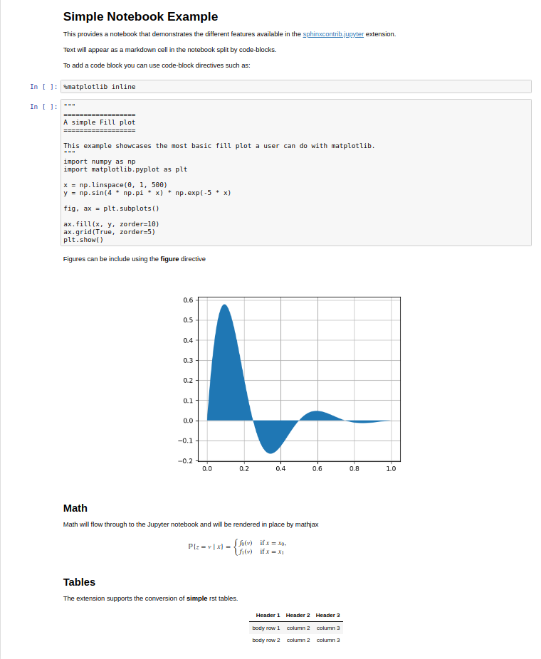

Images
======

Collection of tests for **.. image::** and **.. figure::** directives

Image
-----

`Docutils Reference <http://docutils.sourceforge.net/docs/ref/rst/directives.html#images>`__

Most basic image directive

.. image:: _static/hood.jpg

A scaled down version with 25 % width

.. image:: _static/hood.jpg
   :width: 25 %

A height of 50px

.. image:: _static/hood.jpg
   :height: 50px

Including *alt*

.. image:: _static/hood.jpg
   :alt: A Mountain View

An image with a *right* alignment

.. image:: _static/hood.jpg
   :scale: 75 %
   :align: right

An image with a *left* alignment

.. image:: _static/hood.jpg
   :scale: 50 %
   :align: left

Figure
------

`Docutils Reference <http://docutils.sourceforge.net/docs/ref/rst/directives.html#figure>`__

Testing the **.. figure::** directive

.. figure:: _static/hood.jpg
   :scale: 50 %

File Collisions
---------------

Add a figure of the same name in a different folder

Most basic image directive

Remote Images
-------------

Adding a test for remote images specified by url

.. image:: https://s3-ap-southeast-2.amazonaws.com/assets.quantecon.org/img/sloan_logo.png

and using figure directive

.. figure:: https://s3-ap-southeast-2.amazonaws.com/assets.quantecon.org/img/sloan_logo.png
   :scale: 50 %

Supported Image Path Specifications
-----------------------------------

Adding a relative path image reference

.. image:: _static/hood.jpg

Adding a root level path image reference

.. image:: /_static/hood.jpg

Adding a path to base level _static folder outside of `base` project folder

